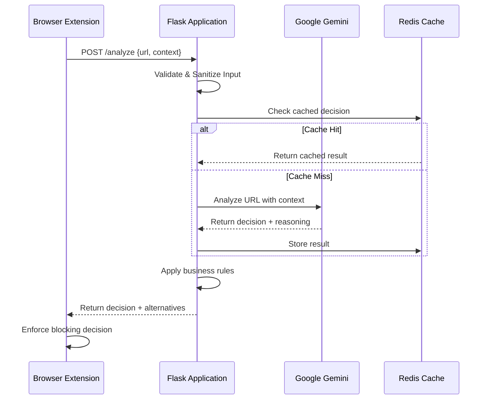
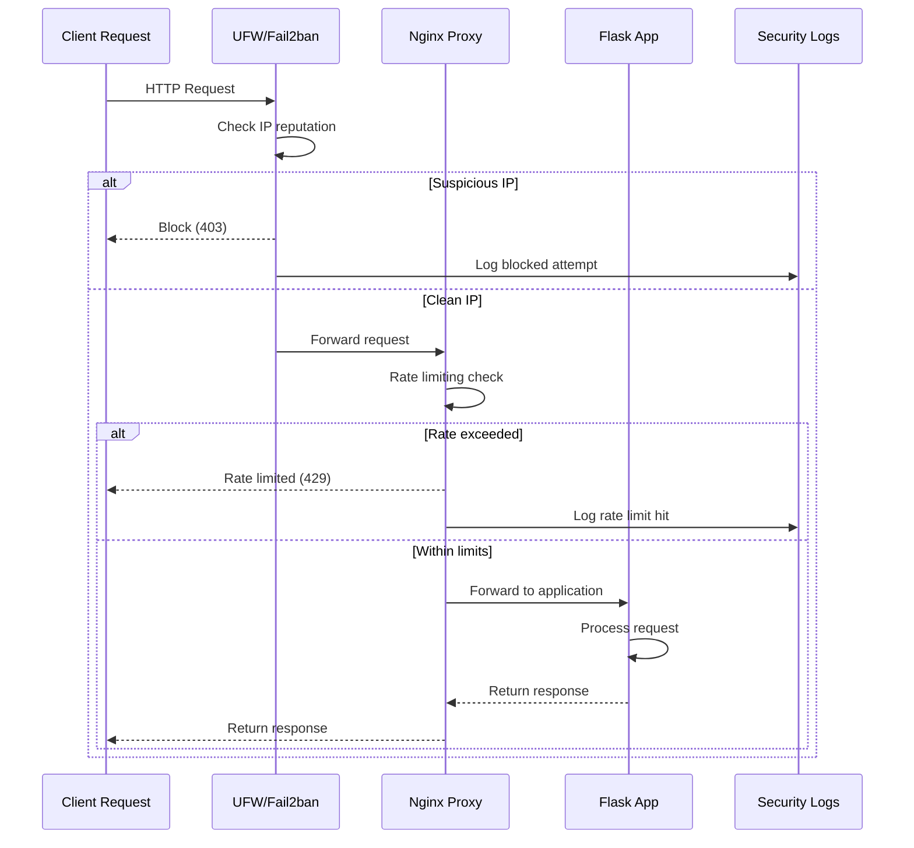

# System Architecture

## Overview

Eclipse Shield follows a multi-layered architecture designed for security, scalability, and maintainability. The system consists of browser extensions, a secure backend API, AI integration, and comprehensive security layers.

## High-Level Architecture

```
┌─────────────────────────────────────────────────────────────┐
│                    Browser Extensions                       │
│         (Chrome, Opera - Cross-platform)                   │
└─────────────────────┬───────────────────────────────────────┘
                      │ HTTPS/WSS
                      │ Secure Message Passing
┌─────────────────────▼───────────────────────────────────────┐
│                 Security Layer                              │
│  ┌─────────────┬─────────────┬─────────────┬─────────────┐  │
│  │ UFW Firewall│  Fail2ban   │   Nginx     │Rate Limiting│  │
│  │   Rules     │ Intrusion   │ Reverse     │ (Redis)     │  │
│  │             │ Prevention  │ Proxy       │             │  │
│  └─────────────┴─────────────┴─────────────┴─────────────┘  │
└─────────────────────┬───────────────────────────────────────┘
                      │
┌─────────────────────▼───────────────────────────────────────┐
│              Application Layer                              │
│  ┌─────────────────────────────────────────────────────────┐ │
│  │            Flask Application                            │ │
│  │  ┌─────────────┬─────────────┬─────────────────────────┐ │ │
│  │  │   Security  │   API       │    Core Business       │ │ │
│  │  │ Middleware  │ Endpoints   │       Logic            │ │ │
│  │  │             │             │                        │ │ │
│  │  └─────────────┴─────────────┴─────────────────────────┘ │ │
│  └─────────────────────────────────────────────────────────┘ │
└─────────────────────┬───────────────────────────────────────┘
                      │
┌─────────────────────▼───────────────────────────────────────┐
│               Integration Layer                             │
│  ┌─────────────────────────────────────────────────────────┐ │
│  │              Google Gemini API                          │ │
│  │        (AI Analysis & Decision Making)                  │ │
│  └─────────────────────────────────────────────────────────┘ │
│  ┌─────────────────────────────────────────────────────────┐ │
│  │                 Redis Cache                             │ │
│  │    (Rate Limiting, Session Storage, Caching)           │ │
│  └─────────────────────────────────────────────────────────┘ │
└─────────────────────────────────────────────────────────────┘
```

## Component Details

### 1. Browser Extensions

#### Architecture Pattern
- **Cross-platform compatibility**: Shared codebase with browser-specific manifests
- **Content Scripts**: Inject analysis logic into web pages
- **Background Scripts**: Handle API communication and decision enforcement
- **Popup Interface**: User configuration and status display

#### Key Components
```
extension/
├── manifest.json                 # Chrome manifest
├── manifest-opera.json          # Opera-specific manifest  
├── background.js                # Main background service worker
├── newTab-override.js           # New tab page functionality
├── popup.js                     # Extension popup logic
├── block.js                     # Website blocking logic
└── rules.json                   # Client-side filtering rules
```

#### Communication Flow
1. **Page Load**: Content script analyzes current URL
2. **API Call**: Secure request to backend for analysis
3. **Decision**: AI determines if site should be blocked
4. **Enforcement**: Block page displayed or access granted
5. **Learning**: User feedback sent back to improve AI

### 2. Security Layer

#### Multi-Layered Defense
```
Internet → UFW Firewall → Fail2ban → Nginx → Rate Limiting → Application
```

#### Security Components

**UFW Firewall**
- Port restriction (22, 80, 443 only)
- IP-based blocking rules
- Geographic filtering capabilities

**Fail2ban**
- Real-time intrusion detection
- Automatic IP blocking on suspicious activity
- Custom rules for application-specific threats

**Nginx Reverse Proxy**
- SSL/TLS termination
- Request filtering and validation
- Security headers injection
- Static file serving with caching

**Rate Limiting (Redis)**
- Sliding window algorithm
- Per-IP and per-API-key limits
- Burst protection with token buckets
- Automatic cleanup and scaling

### 3. Application Layer

#### Flask Application Architecture

```python
secure_app.py                    # Application factory
├── Security Middleware          # Custom security layer
├── Authentication System        # API key & CSRF management
├── Input Validation Engine      # Comprehensive sanitization
├── Rate Limiting Integration    # Redis-backed throttling
└── Error Handling Framework     # Secure error responses
```

#### Core Components

**Security Middleware** (`security.py`)
```python
class SecurityMiddleware:
    - Input validation and sanitization
    - CSRF token management
    - Security header injection
    - Request/response filtering
```

**Productivity Analyzer** (`script.py`)
```python
class ProductivityAnalyzer:
    - AI model integration
    - Context analysis
    - Decision logic
    - Learning algorithms
```

**API Layer**
- RESTful endpoints for browser communication
- Comprehensive input validation
- Structured error responses
- API versioning support

### 4. Integration Layer

#### Google Gemini AI Integration

**Architecture Pattern**: Secure Proxy Pattern
- API calls proxied through backend (never direct from browser)
- Prompt injection prevention
- Response validation and sanitization
- Failure handling and graceful degradation

**AI Processing Pipeline**:
```
User Context → Prompt Engineering → Gemini API → Response Validation → Decision Logic
```

**Security Measures**:
- Input sanitization before prompt creation
- Response content filtering
- Rate limiting on AI API calls
- Error handling for AI service failures

#### Redis Integration

**Usage Patterns**:
- **Rate Limiting**: Sliding window counters
- **Session Storage**: Encrypted user sessions
- **Caching**: AI responses and analysis results
- **Configuration**: Dynamic settings and rules

**Architecture**:
```python
Redis Cluster (Production)
├── Rate Limiting Database (DB 0)
├── Session Storage (DB 1) 
├── Cache Storage (DB 2)
└── Configuration (DB 3)
```

## Data Flow Architecture

### 1. URL Analysis Flow



### 2. Security Event Flow



## Deployment Architectures

### 1. Development Architecture

```
Developer Machine
├── Python Virtual Environment
├── Local Redis (optional)
├── SQLite for development data
└── Direct AI API calls
```

**Characteristics**:
- Single process Flask development server
- Minimal security (localhost only)
- File-based configuration
- Debug logging enabled

### 2. Production Architecture

```
Production Server(s)
├── Nginx Load Balancer
├── Multiple Gunicorn Workers
├── Redis Cluster
├── Centralized Logging
├── Process Monitoring (Supervisor)
└── Automated Backups
```

**Characteristics**:
- Multi-process WSGI server (Gunicorn)
- Full security stack enabled
- Database-backed configuration
- Production logging and monitoring

### 3. Containerized Architecture (Docker)

```yaml
Services:
  - nginx-proxy:        # Reverse proxy
  - eclipse-shield:     # Main application (scaled)
  - redis:             # Cache and rate limiting
  - redis-sentinel:    # Redis high availability
  - log-aggregator:    # Centralized logging
```

**Benefits**:
- Horizontal scaling capabilities
- Container orchestration (Kubernetes ready)
- Simplified deployment and rollbacks
- Resource isolation and management

## Security Architecture Details

### 1. Authentication & Authorization

```python
Authentication Flow:
1. API Key Validation
2. CSRF Token Verification (web requests)
3. Rate Limit Check
4. Request Signature Validation
5. Input Sanitization
6. Business Logic Execution
```

### 2. Input Validation Pipeline

```python
Input Validation Layers:
1. Schema Validation (JSON structure)
2. Type Validation (data types)
3. Range Validation (lengths, values)
4. Content Validation (XSS, injection)
5. Business Rule Validation
6. Sanitization & Encoding
```

### 3. Security Headers Implementation

```python
Security Headers:
- Content-Security-Policy: Prevents XSS
- X-Frame-Options: Prevents clickjacking
- X-Content-Type-Options: Prevents MIME sniffing
- Strict-Transport-Security: Enforces HTTPS
- Referrer-Policy: Controls referrer information
```

## Performance Considerations

### 1. Caching Strategy

**Multi-Level Caching**:
```
Browser Cache → CDN → Nginx Cache → Redis Cache → Application Cache
```

**Cache Policies**:
- Static assets: 1 year expiration
- API responses: 5-15 minutes based on endpoint
- AI analysis results: 1 hour (with invalidation triggers)

### 2. Database Optimization

**Redis Performance**:
- Connection pooling
- Pipeline operations for bulk updates
- Memory optimization with appropriate data structures
- Clustering for high availability

### 3. Application Performance

**Flask Optimization**:
- Gunicorn with gevent workers for async I/O
- Connection pooling for external APIs
- Background task processing
- Efficient serialization (msgpack over JSON where appropriate)

## Monitoring & Observability

### 1. Application Metrics

```python
Key Metrics:
- Request rate and response times
- Error rates by endpoint
- AI API response times and success rates
- Security event frequencies
- Resource utilization (CPU, memory, disk)
```

### 2. Security Monitoring

```python
Security Events:
- Authentication failures
- Rate limit violations
- Suspicious IP activity
- Input validation failures
- Unauthorized access attempts
```

### 3. Business Metrics

```python
Business KPIs:
- User productivity scores
- Website blocking effectiveness
- AI decision accuracy
- User engagement metrics
```

## Scalability Design

### 1. Horizontal Scaling

**Stateless Application Design**:
- No server-side session storage
- External state management (Redis)
- Load balancer compatibility
- Auto-scaling capabilities

### 2. Database Scaling

**Redis Scaling Strategy**:
- Master-slave replication
- Sentinel for high availability
- Cluster mode for large datasets
- Read replicas for query distribution

### 3. AI API Scaling

**Google Gemini Integration**:
- Connection pooling and keep-alive
- Intelligent retry mechanisms
- Graceful degradation on API failures
- Local fallback rules for critical decisions

This architecture provides a robust, secure, and scalable foundation for Eclipse Shield while maintaining flexibility for future enhancements and integrations.
